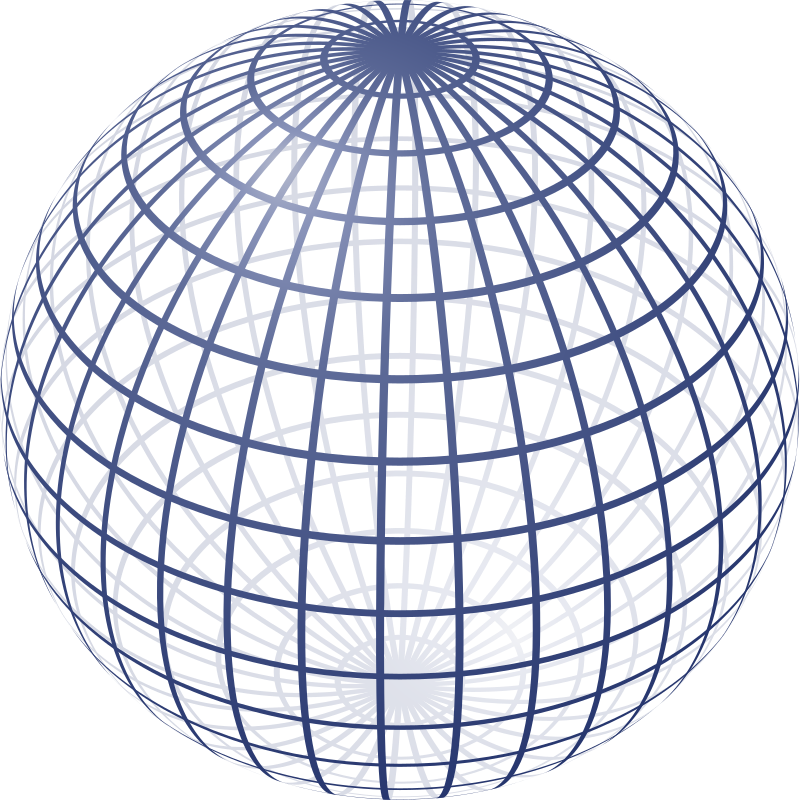
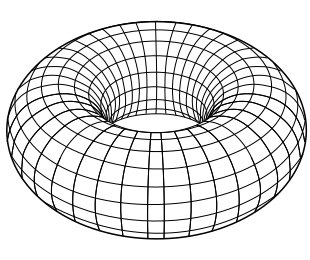

```{r xaringan-themer, include = FALSE}
options(htmltools.dir.version = FALSE)
library(ggplot2)
library(anicon)
library(plotly)
library(dplyr)
livedemosign <- function(top, left, deg) {
  htmltools::div("Live Demo!", class="faa-flash animated",
                 style=glue::glue("border:solid; border-color:black; position:absolute; top:{top}%; left:{left}%; font-size:36px; padding:4px; background-color:white; color:black;transform:rotate({deg}deg);")
                 )
}

library(xaringanthemer)
mono_light(
  extra_css = list(
      # "h1" = list("color" = "#1E90FF"),
      "h1" = list("color" = "#0a0a0a"),
      ".teeny" = list("font-size" = "10%"),
      ".dblue" = list("color" = "#1E90FF"),
      # "h2" = list("color" = "#1E90FF"),
      # ".title-slide h3" = list("color" = "#0a0a0a"),
      ".title-slide h3" = list("color" = "#ffffff"),
      ".title-slide h1" = list("font-size" = "42pt"),
      ".title-slide h1" = list("color" = "#ffffff"),
      # ".title-slide h1" = list("color" = "#0a0a0a"),
      ".caption" = list("text-align" = "center","font-size" = "10pt"),
      ".image-50 img" = list("width"="50%")
                   ),
  # text_font_size = "24pt",
  base_color = "#0a0a0a",
  # title_slide_background_color = "#9fcdde",
  title_slide_background_color = "#ffffff",
  title_slide_text_color = "#1e90ff",
  background_color = "#ffffff",
  # title_slide_text_color = "#1E90FF",
  # header_font_google = google_font("Luminari"),
  # text_font_google   = google_font("Californian FB"),
  text_font_google   = google_font('Ubuntu'),
  # title_slide_background_image  = 'https://wallpapercave.com/wp/91vqmm7.jpg',
  # text_color = "#1E90FF"
)
```

```{r, load_refs, include=FALSE, cache=FALSE}
library(RefManageR)
setwd('/Users/vishwanathgl/Box/TDA/Presentations/ATMCS/')
BibOptions(check.entries = FALSE,
           bib.style = "authoryear",
           cite.style = "text",
           style = "markdown",
           hyperlink = FALSE,
           dashed = FALSE)
myBib <- ReadBib("references.bib", check = FALSE)
```

```{r setup, include=FALSE}
options(htmltools.dir.version = FALSE)
```

class: inverse, center, title-slide, middle
count: false

<style>
.inverse {
  background-color: #1b1b1b;
}
.title-slide .remark-slide-number {
  display: none;
}
</style>


# .orange[Statistical Invariance of Betti Numbers <br> .tiny[In the thermodynamic regime]]

### <br><br><br>  Siddharth Vishwanath <br> .small[.grey[With Kenji Fukumizu, Satoshi Kuriki & Bharath Sriperumbudur]]

<!-- ###  <br><br> 3 August, 2020 -->


---

# Outline

1. .large[.orange[.bolder[Statistics + Topology]]]<br/><br/><br/>

1. .large[.bolder[Preliminaries]]<br/><br/><br/>

1. .large[.bolder[Invariance : Characterization]]<br/><br/><br/>

1. .large[.bolder[Invariance via Topological Groups]]<br/><br/><br/>

1. .large[.bolder[Invariance via Excess Mass]]<br/><br/><br/>


---
class: inverse, center, middle
count: false

# Statistics + Topology

---

# Sufficient Statistics may not suffice

<!--  -->

.center[Anscombe's quartet]
</div>


---
# Sufficient Statistics may not suffice


<div class="centered">

.center[Anscombe's quartet on steroids]
</div>

<br/><br/><br/><br/><br/>

.tiny[.grey[Datasaurus by Alberto Cairo]]


---
layout: false
class: inverse, center, middle
count: false

# Preliminaries
## .orange[Topological Ingredients]


---
layout: true
class: split-five with-border border-black

.column[.content[
.split-five[
.row.bg-main1[.content.center.vmiddle[
# Space
]]
.row.bg-main2[.content.center[
## Circle
]]
.row.bg-main3[.content.center[
## Sphere
]]
.row.bg-main4[.content.center[
## Torus
]]
.row.bg-main5[.content.center[
## $3d_{z^2}$
]]
]]]
.column[.content[
.split-five[
.row.bg-main1[.content.center.vmiddle[
# Shape
]]
.row.bg-main2[.content.center[

]]
.row.bg-main3[.content.center[

]]
.row.bg-main4[.content.center[

]]
.row.bg-main5[.content.center[

]]
]]]
.column[.content[
.split-five[
.row.bg-main1[.content.center.vmiddle[
# $\beta_0$ 
]]
.row.bg-main2[.content.center[
## 1
]]
.row.bg-main3[.content.center[
## 1
]]
.row.bg-main4[.content.center[
## 1
]]
.row.bg-main5[.content.center[
## 1
]]
]]]
.column[.content[
.split-five[
.row.bg-main1[.content.center.vmiddle[
# $\beta_1$
]]
.row.bg-main2[.content.center[
## 1
]]
.row.bg-main3[.content.center[
## 0
]]
.row.bg-main4[.content.center[
## 2
]]
.row.bg-main5[.content.center[
## 1
]]
]]]
.column[.content[
.split-five[
.row.bg-main1[.content.center.vmiddle[
# $\beta_2$ 
]]
.row.bg-main2[.content.center[
## 0
]]
.row.bg-main3[.content.center[
## 1
]]
.row.bg-main4[.content.center[
## 1
]]
.row.bg-main5[.content.center[
## 3
]]
]]]

---
class: fade-row2 fade-row3 fade-row4 fade-row5 gray-row2 gray-row3 gray-row4 gray-row5

---
count: false
class: fade-row3 fade-row4 fade-row5 gray-row3 gray-row4 gray-row5

---
count: false
class: fade-row2 fade-row4 fade-row5 gray-row2 gray-row4 gray-row5

---
count: false
class: fade-row2 fade-row3 fade-row5 gray-row2 gray-row3 gray-row5

---
count: false
class: fade-row2 fade-row3 fade-row4 gray-row2 gray-row3 gray-row4


---
layout: false
class: inverse, center, middle
count: false

# Preliminaries
## .orange[Probabilistic Ingredients]


---
# Stochastic Topology

Given a probability space $(\Omega,\mathcal{F},\mathbb{P})$ and some metric-space $\mathcal{X}$


--
$\mathbb{X}_n = \{ \boldsymbol{X}_1, \boldsymbol{X}_2, \dots \boldsymbol{X}_n \} \sim \mathbb{P}$


  * A fixed probability measure, i.e., observed i.i.d.
  
  * A random field, e.g., Poisson Process


--
<br/>
$\mathcal{K}(\mathbb{X}_n,r)$ is a random-variable measurable w.r.t. $\mathbb{P}^{\otimes n}$
<br/><br/>


--
$\boldsymbol{S} : \mathcal{X}^n \rightarrow \mathcal{S}$ is a topological summary
  * $\beta_k(\mathbb{X}_n) : \mathcal{X}^n \rightarrow \mathbb{N}$
  
  * $\textbf{Dgm}(\mathbb{X}_n) : \mathcal{X}^n \rightarrow \{(x,y) : 0 \le x < y \le \infty \}$
  
--
<br/><br/>

**.purple[Objective:]** &nbsp; &nbsp; What are the properties of these random topological summaries?<br/>

.caption[`r Citet(myBib,author=c("Mileyko","Edelsbrunner","Turner"),title=c("Probability measures","Computational Topology: An Introduction"))`]

---
layout: true
class: center,split-three

# .left[Asymptotic Regimes]

In the simplicial complex $\mathcal{K}\left( \mathbb{X}_n, \mathbf{r_n} \right)$, $r_n$ depends on $n$

.column.bg-main1[.content[
<br><br><br><br><br><br><br>
.center[
Sparse
]
$nr_n^d \rightarrow 0$
]]

.column.bg-main1[.content[
<br><br><br><br><br><br><br>
.center[
Thermodynamic
]
$nr_n^d \rightarrow t \in (0,\infty)$
]]

.column.bg-main1[.content[
<br><br><br><br><br><br><br>
.center[
Dense
]
$nr_n^d \rightarrow \infty$
]]

---

class: show-100
<br><br><br><br><br><br><br><br><br><br><br><br><br><br><br>


---

class: show-110
count: false


---
class: show-111
count: false


---
layout: false
# Random Betti Numbers

<br/><br/><br/>
* Law of Large Numbers: 
$$
\lim\limits_{n\rightarrow \infty}\frac{1}{n}\beta_k(\mathbb{X}_n,r_n) = \color{red}{\gamma_k(\mathbb{P})} \ \ \text{a.s.}
$$
<br/><br/><br/>
* Central Limit Theorem: 
$$
\lim\limits_{n\rightarrow \infty}\frac{\beta_k(\mathbb{X}_n,r_n) - \mathbb{E}(\beta_k(\mathbb{X}_n,r_n))}{\sqrt{n}}  \sim \mathcal{N}(0,\sigma^2)
$$
<br/><br/><br/>

.caption[`r Citet(myBib,author=c("Meckes","Adler","Bobrowski"),title=c("Limit Theorems","Random"))`]


---
layout: false
count: false
class: inverse, center, middle

# Statistical Invariance
## .orange[Characterization]

---
layout: false

# Statistical Invariance

* Consider a family of distributions $\mathcal{P} = \{\mathbb{P}_\theta : \theta \in \Theta \}$

* Given $\mathbb{X}^\theta_n = \{\mathbf{X}^\theta_1,\mathbf{X}^\theta_2,\dots,\mathbf{X}^\theta_n\} \sim \mathbb{P}_\theta$, for $\theta \in \Theta$

* $\mathbf{S}(\mathbb{P}_{\theta}^{\otimes n}) := \mathbf{S}(\mathbb{X}^\theta_n)$ is a topological summary

--
* **.purple[Injectivity.]** 

.center[<body>  $\bbox[20px, border: 2px solid orange]{ \text{For } \theta_1,\theta_2 \in \Theta, \text{ can we have that } \lim\limits_{n\rightarrow \infty}\mathbf{S}(\mathbb{P}_{\theta_1}^{\otimes n}) \stackrel{d}{=} \mathbf{S}(\mathbb{P}_{\theta_2}^{\otimes n}) \text{ ? } }$</body>]

--
* **Example.**

  **(1).**   Consider $\color{red}{\mathcal{P} = \{ \mathcal{N}(\theta,\mathbf{I}_d) : \theta \in \mathbb{R}^d \}}$ and $\color{green}{\mathbf{S}(\mathbb{X}_n) = \bar{\mathbf{X}}_n}$
  
      $\hspace{3cm} \lim\limits_{n\rightarrow \infty}\bar{\mathbf{X}}^{\theta_1}_n = \theta_1 \neq \theta_2 = \lim\limits_{n\rightarrow \infty}\bar{\mathbf{X}}^{\theta_2}_n$

---
layout: false
count: false

# Statistical Invariance

* Consider a family of distributions $\mathcal{P} = \{\mathbb{P}_\theta : \theta \in \Theta \}$

* Given $\mathbb{X}^\theta_n = \{\mathbf{X}^\theta_1,\mathbf{X}^\theta_2,\dots,\mathbf{X}^\theta_n\} \sim \mathbb{P}_\theta$, for $\theta \in \Theta$

* $\mathbf{S}(\mathbb{P}_{\theta}^{\otimes n}) := \mathbf{S}(\mathbb{X}^\theta_n)$ is a topological summary


* **.purple[Injectivity.]** 

.center[<body>  $\bbox[20px, border: 2px solid orange]{ \text{For } \theta_1,\theta_2 \in \Theta, \text{ can we have that } \lim\limits_{n\rightarrow \infty}\mathbf{S}(\mathbb{P}_{\theta_1}^{\otimes n}) \stackrel{d}{=} \mathbf{S}(\mathbb{P}_{\theta_2}^{\otimes n}) \text{ ? } }$</body>]


* **Example.**

  **(2).**   Consider $\color{red}{\mathcal{P} = \{ \mathcal{N}(\mathbf{0},\boldsymbol{\theta}) : \boldsymbol{\theta} \in \mathcal{S^d_{++}} \}}$ and $\color{green}{\mathbf{S}(\mathbb{X}_n) = \bar{\mathbf{X}}_n}$
  
      $\hspace{3.5cm} \lim\limits_{n\rightarrow \infty}\bar{\mathbf{X}}^{\theta_1}_n = 0 = \lim\limits_{n\rightarrow \infty}\bar{\mathbf{X}}^{\theta_2}_n$

---
layout: false
count: false

# Statistical Invariance

* Consider a family of distributions $\mathcal{P} = \{\mathbb{P}_\theta : \theta \in \Theta \}$

* Given $\mathbb{X}^\theta_n = \{\mathbf{X}^\theta_1,\mathbf{X}^\theta_2,\dots,\mathbf{X}^\theta_n\} \sim \mathbb{P}_\theta$, for $\theta \in \Theta$

* $\mathbf{S}(\mathbb{P}_{\theta}^{\otimes n}) := \mathbf{S}(\mathbb{X}^\theta_n)$ is a topological summary


* **.purple[Injectivity.]** 

.center[<body>  $\bbox[20px, border: 2px solid orange]{ \text{For } \theta_1,\theta_2 \in \Theta, \text{ can we have that } \lim\limits_{n\rightarrow \infty}\mathbf{S}(\mathbb{P}_{\theta_1}^{\otimes n}) \stackrel{d}{=} \mathbf{S}(\mathbb{P}_{\theta_2}^{\otimes n}) \text{ ? } }$</body>]


* **Example.**

  **(3).**   Consider $\color{red}{\mathcal{P} = \{ \mathcal{N}(\mathbf{0},\boldsymbol{\theta}) : \boldsymbol{\theta} \in \mathcal{S^d_{++}} \}}$ and $\color{green}{\mathbf{S}(\mathbb{X}_n) = \text{Cov}(\mathbb{X}_n)}$
  
      $\hspace{2cm} \lim\limits_{n\rightarrow \infty}\text{Cov}(\mathbb{X}^{\theta_1}_n) = \boldsymbol{\theta}_1 \neq \boldsymbol{\theta}_2 = \lim\limits_{n\rightarrow \infty}\text{Cov}(\mathbb{X}^{\theta_2}_n)$

---
layout: false

# Statistical Invariance .purple[of Betti Numbers]

* $\mathcal{P} =  \{\mathbb{P}_\theta : \theta \in \Theta \}$ is a family of distributions $\hspace{-10cm }^\textbf{*}$ on $\mathcal{X} \subseteq \mathbb{R}^D$ 
.small[.footnote[
*Assumptions: 
1. .small[<body> $\text{dim}(\mathcal{X}) = d \le D$. If $d < D$ then $\mathcal{X}$ is a compact, $d$-dimensional $\mathcal{C}^1$ manifold </body> ]
1. .small[<body> $\mathbb{P}_\theta$ admits a density $f_\theta$ such that $f_\theta \in L_p(\mathcal{X})$ for all $p \in \mathbb{N}$ </body> ]
]]

--
* $\mathcal{K}(\mathbb{X}^\theta_n,r_n)$ is the Čech complex constructed on $\mathbb{X}^\theta_n$ with $r_n = r(n)$


* The topological summary is .purple[the collection of Betti numbers]
\begin{align}
  \mathbf{S}(\mathbb{P}_{\theta}^{\otimes n}) = \frac{1}{n} \Big( \beta_0\big( \mathcal{K}(\mathbb{X}^\theta_n,r_n) \big), \beta_1\big( \mathcal{K}(\mathbb{X}^\theta_n,r_n) \big), \dots , \beta_d\big( \mathcal{K}(\mathbb{X}^\theta_n,r_n) \big) \Big)
\end{align}

--
* As $n \rightarrow \infty$ and $nr_n^d \rightarrow t$, the **.purple[thermodynamic limit]** is the functional 
\begin{align}
\mathbf{S}(\mathbb{P}_\theta; t) = \lim_{n \rightarrow\infty}\mathbf{S}(\mathbb{P}_{\theta}^{\otimes n})
\end{align}

--
.center[<body>  ${\bbox[20px, border: 2px solid orange]{\color{orange}{\textbf{Objective: }} \text{Under what conditions does } S(\mathbb{P}_\theta; t) = \eta(t) \text{ for all } \theta \in \Theta \text{ ? } }}$</body>]

---
layout: false

# $\beta$-equivalence

* **.purple[Definition:]**  $\mathcal{P}$ admits $\beta$-equivalence if $\mathbf{S}(\mathbb{P}; t) = \mathbf{S}(\mathbb{Q}; t)$ for each $\mathbb{P},\mathbb{Q} \in \mathcal{P}$ and for all $t > 0$

* Let $\color{purple}{\mathcal{F}}$ be the family of probability density functions associated with $\color{purple}{\mathcal{P}}$

--
.content-box-purple[**.purple[Proposition:]** Suppose $\mathcal{F}$ is a family of distributions such that:<br> 
for all $f,g \in \mathcal{F}$ with $\mathbf{X} \sim f$ and $\mathbf{Y} \sim g$, it holds that $f(\mathbf{X}) \stackrel{d}{=} g(\mathbf{Y})$. <br> 
Then, $\mathcal{F}$ admits $\beta$-equivalence.]


--
* **.purple[Main idea:]** The SLLN results from `r Citet(myBib,author=c("Subag"),title=c("Random"))`; `r Citet(myBib,author=c("Trinh"),title=c("Remark"))`; `r Citet(myBib,author=c("Goel"),title=c("Strong"))` are used to express $\mathbf{S}(\mathbb{P}; t)$ as an expectation.


--
* **.purple[Remark:]** Invariance also extends to persistent Betti numbers and Euler characteristic. 


---
layout: false
count: false
class: inverse, center, middle

# Statistical Invariance
## .orange[via Topological Groups]


---
layout: false

# Group Invariance in Statistics

* Let $\mathcal{G} = \{ g_\theta : \theta \in \Theta \}$ be a topological group acting bijectively on $\mathcal{X}$

* Consider a map $T: \mathcal{X} \rightarrow \mathcal{T}$

  - $T$ is $\color{purple}{\mathcal{G}}$.purple[-invariant] if it is constant on orbits, i.e., $T(g_\theta\cdot\mathbf{x}) = T(\mathbf{x})$
  
  - $T$ is $\color{red}{\mathcal{G}}$.red[-maximal invariant] if it is constant **only** on orbits, i.e.,.center[ <body> $T(\mathbf{x}) = T(\mathbf{y})$ if and only if $\mathbf{y} \in \mathcal{G}\mathbf{x}$ </body>]


--
* Let $\mathbf{X} \sim f$ be a random variable taking values in $\mathcal{X}$

* The action of $g \in \mathcal{G}$ on $\mathbf{X}$ *induces* a new random variable $g_\theta \cdot \mathbf{X} \sim f_\theta$

* $\mathcal{G} = \{ g_\theta : \theta \in \Theta \}$ *generates* a family of distributions $\mathcal{F} = \{f_\theta : \theta \in \Theta\}$

---
layout: false

# Statistical Invariance - I

.content-box-purple[**.purple[Theorem.]** 
* Suppose
  - $\Psi:\mathcal{X} \rightarrow \mathcal{Y}$ is differentiable 
  - $\mathcal{G} = \{ g_\theta : \theta \in \Theta \}$ is a group of Borel isometries acting bijectively on $\mathcal{Y}$
  - $T:\mathcal{Y} \rightarrow \mathcal{T}$ is $\mathcal{G}$-maximal invariant

* Define a family of distributions $\mathcal{F} = \{ f_\theta : \theta \in \Theta \}$ by
\begin{align}
f_\theta(x) := \phi\big( g_\theta \circ \Psi(x) \big),
\end{align}
 where $\phi$ ensures $f_\theta$ is a valid density function. 
 
* Then, $\mathcal{F}$ admits $\beta$-equivalence if and only if there exists some $\zeta:\mathcal{T} \rightarrow \mathbb{R}$
$$
\text{det}(J_{\Psi^{-1}}(x)) = \zeta(T(x)),
$$]

---

layout: false

# Statistical Invariance - I : .purple[Example]

.small[ <body> For $\mathcal{X} = [0,1]^2$, $\theta \in [0,2\pi]$ and $\Phi(x)$ -- the inverse CDF of $\mathcal{N}(0,1)$ </body>]
.small[.center[.content-box-red[
$\smash{f_\theta(x,y) = \big( \cos(\theta) \Phi^{-1}(x) + \sin(\theta )\Phi^{-1}(y) \big) \mathbf{1}(0 \le x,y \le 1)}$
]]]

--

<!-- .pull-left[ <body> $\mathcal{G} = SO(2)$ </body> ] -->
<!-- .pull-right[ .right[ <body> $\Psi(x,y) = (\Phi^{-1}(x),\Phi^{-1}(y))$ </body> ]] -->
.center[]

.tiny[<body> $\mathcal{G} = SO(2), \hspace{0.2cm}$ $\Psi(x,y) = (\Phi^{-1}(x),\Phi^{-1}(y)), \hspace{0.2cm}$ $\phi(x) = x^2,\hspace{0.2cm}$ $T(x,y) = \sqrt{x^2+y^2}$ </body>]


---
layout: false
count: false
class: inverse, center, middle

# Statistical Invariance
## .orange[via Excess Mass]


---
layout: false

# Statistical Invariance - II

.small[
- For $\mathbb{P}$ with pdf $f$, the **.purple[excess mass function]** is given by $\hat{f}(t)\!:=\!\mathbb{P}\big(\!\{ \mathbf{x}\!\in\!\mathcal{X}\!:\!f(\mathbf{x})\!\ge\!t \}\!\big)$<br>
  $\hspace{1cm}$ `r anicon::faa("hand-point-right", animate="horizontal")` If $\mathbf{X} \sim f$ and $\mathbf{Y} \sim g$, then $f(\mathbf{X}) \stackrel{d}{=} g(\mathbf{Y}) \iff \hat{f} = \hat{g}$
]

--
.small[
- Given a measure $\mu$ on $\mathcal{X}$, a function $\Psi(\cdot)$ is the .purple[modular character of] $\color{purple}{\mu}$ if <br> for each $\phi \in \text{Diff}(\mathcal{X})$ and $\mathbf{y} = \phi(\mathbf{x})$, $\hspace{0.25cm}\mu(d\mathbf{y}) = \Psi(|\text{det}J_\phi|)\mu(d\mathbf{x})$<br>
  $\hspace{1cm}$ **Example.** When $\mathcal{X} = \mathbb{R}^d$ and $\mu = \nu_d$ (Lebesgue), $\Psi(x) = x$
]

--
.small[.content-box-purple[**.purple[Theorem.]** Suppose $\mathbb{P}$ has density $g \hspace{0.2cm}$ w.r.t. $\hspace{0.2cm} \nu \hspace{0.2cm}$ with <br> 
    $\hspace{2cm}$ (1) $\text{supp}(g) = K \subset \mathcal{X}$, <br> 
    $\hspace{2cm}$ (2) $\Psi$ is the modular character of $\nu$ <br> 
    $\hspace{2cm}$ (3) Let $\{\phi_1 \dots \phi_n\}$ be maps such that $K_i := \phi_i(K)$ and $\nu(K_i \cap K_j) = 0$.<br>
Define the density $f_\phi$ by
\begin{align}
f_\phi(\mathbf{x}) = \smash{\sum_{i=1}^n{g(\phi_i(\mathbf{x}))}}\mathbf{1}(\mathbf{x} \in K_i)
\end{align}
Then, $\mathcal{F} = \{ f_\phi : \phi \in \Phi \}$ admits $\beta$-equivalence for <br>
.center[ <body> $\Phi := \Big\{ \phi_1 \dots \phi_n : \sum\limits_{i=1}^n{\Psi(|\text{det}J_{\phi^{-1}_i}|)}=1 \Big\}$ </body> ] ] ]


---
layout: false

# Statistical Invariance - II : .purple[Example]
.small[ <body> Given a density $g$ on $\mathbb{R}_+$ and $\Theta = \{ (a,b) : \frac{1}{a} + \frac{1}{b} = 1 \}$, define $\{ f_\theta\!: \theta\!\in\!\Theta \}$ on $\mathcal{X} = \mathbb{R}$ </body>]
.small[.center[.content-box-green[
$$
f_\theta(x) =  \color{red}{g(-bx) \mathbf{1}(x < 0)} + \color{blue}{g(ax) \mathbf{1}(x \ge 0)}
$$
]]]
.center[]


---

layout: false

# Statistical Invariance - I : .purple[Example]

.small[ <body> For $\mathcal{X} = [0,1]^2$, $\theta \in [0,2\pi]$ and $\Phi(x)$ -- the inverse CDF of $\mathcal{N}(0,1)$ </body>]
.small[.center[.content-box-red[
$\smash{f_\theta(x,y) = \big( \cos(\theta) \Phi^{-1}(x) + \sin(\theta )\Phi^{-1}(y) \big) \mathbf{1}(0 \le x,y \le 1)}$
]]]

--

<!-- .pull-left[ <body> $\mathcal{G} = SO(2)$ </body> ] -->
<!-- .pull-right[ .right[ <body> $\Psi(x,y) = (\Phi^{-1}(x),\Phi^{-1}(y))$ </body> ]] -->
.center[]

.tiny[<body> $\mathcal{G} = SO(2), \hspace{0.2cm}$ $\Psi(x,y) = (\Phi^{-1}(x),\Phi^{-1}(y)), \hspace{0.2cm}$ $\phi(x) = x^2,\hspace{0.2cm}$ $T(x,y) = \sqrt{x^2+y^2}$ </body>]


---


class: left

# .left[Statistical Invariance]

* Given $\mathbb{X}^\theta_n = \{\mathbf{X}^\theta_1,\mathbf{X}^\theta_2,\dots,\mathbf{X}^\theta_n\} \sim \mathbb{P}_\theta$ from a family $\mathcal{P} = \{\mathbb{P}_\theta : \theta \in \Theta \}$

* Can we have that $\beta_k(\mathbb{X}_n^{\theta_1}) \stackrel{\mathcal{D}}{=} \beta_k(\mathbb{X}_n^{\theta_2})$ for each $k=0,1,2,\dots$ ?

.center[]
.center[.caption[`r Citet(myBib,author=c("Vishwanath"),title=c("Invariance"))`]]

---

# .left[Stable Topological Summaries]

* Given a sample $\mathbb{X}_n \subset \mathbb{R}^d$ and a Morse function $f : \mathbb{R}^d \rightarrow \mathbb{R}$

* $\textbf{Dgm}\left( Sub(\mathbb{X}_n,f) \right)$ constructed from sublevel sets are more stable.

<iframe src="https://sidv23.shinyapps.io/kernel_density/" width="800" height="400"></iframe>

---


---
class: inverse, center, middle

# ಧನ್ಯವಾದಗಳು!


